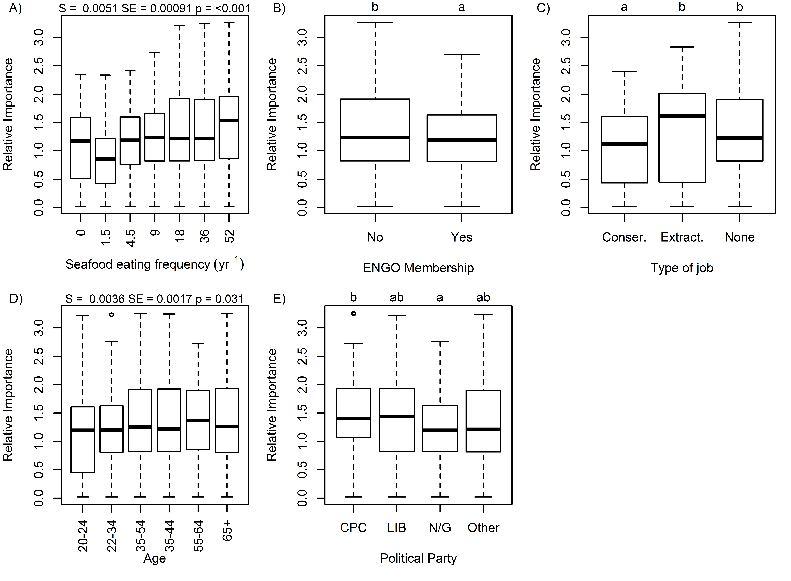
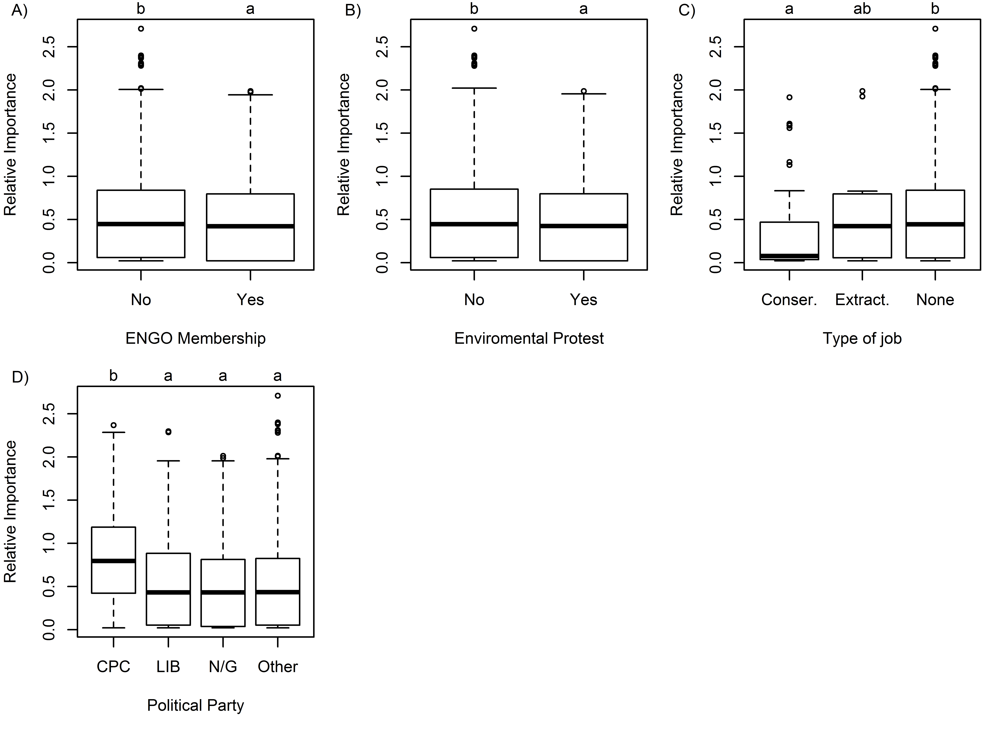

**Figure S1**  Example (Set 1) of best/worst question.
\newpage

**Figure S2**  Relative importance of all demographic and attitudinal variables that have a significant effect on relative importance of Food Provision.  The thick horizontal bars represent medians, the bottom and top of the boxes are the first and third quartile values, respectively, and the whiskers extend 1.5 times the inter-quartile range beyond those. Letters indicate significant differences (Tukey's HSD) for categorical variables and the slope (S), its standard error (SE), and the p-value (linear regression) are reported for continuous variable.
\newpage

**Figure S3**  Relative importance  of all demographic and attitudinal variables that have a significant effect on relative importance of Aboriginal Needs.  The thick horizontal bars represent medians, the bottom and top of the boxes are the first and third quartile values, respectively, and the whiskers extend 1.5 times the inter-quartile range beyond those. Letters indicate significant differences (Tukey's HSD) for categorical variables and the slope (S), its standard error (SE), and the p-value (linear regression) are reported for continuous variable.
\newpage

**Figure S4**  Relative importance of all demographic and attitudinal variables that have a significant effect on relative importance of Natural Products.  The thick horizontal bars represent medians, the bottom and top of the boxes are the first and third quartile values, respectively, and the whiskers extend 1.5 times the inter-quartile range beyond those. Letters indicate significant differences (Tukey's HSD) for categorical variables and the slope (S), its standard error (SE), and the p-value (linear regression) are reported for continuous variable.
\newpage

**Figure S5** Relative importance of all demographic and attitudinal variables that have a significant effect on relative importance of Carbon Storage.  The thick horizontal bars represent medians, the bottom and top of the boxes are the first and third quartile values, respectively, and the whiskers extend 1.5 times the inter-quartile range beyond those. Letters indicate significant differences (Tukey's HSD) for categorical variables and the slope (S), its standard error (SE), and the p-value (linear regression) are reported for continuous variable.
\newpage

**Figure S6** Relative importance of all demographic and attitudinal variables that have a significant effect on relative importance of Coastal Protection.  The thick horizontal bars represent medians, the bottom and top of the boxes are the first and third quartile values, respectively, and the whiskers extend 1.5 times the inter-quartile range beyond those. Letters indicate significant differences (Tukey's HSD) for categorical variables and the slope (S), its standard error (SE), and the p-value (linear regression) are reported for continuous variable.
\newpage

**Figure S7** Relative importance of all demographic and attitudinal variables that have a significant effect on relative importance of Coastal Livelihoods.  The thick horizontal bars represent medians, the bottom and top of the boxes are the first and third quartile values, respectively, and the whiskers extend 1.5 times the inter-quartile range beyond those. Letters indicate significant differences (Tukey's HSD) for categorical variables and the slope (S), its standard error (SE), and the p-value (linear regression) are reported for continuous variable.
\newpage

**Figure S8** Relative importance of all demographic and attitudinal variables that have a significant effect on relative importance of Tourism & Recreation.  The thick horizontal bars represent medians, the bottom and top of the boxes are the first and third quartile values, respectively, and the whiskers extend 1.5 times the inter-quartile range beyond those. Letters indicate significant differences (Tukey's HSD) for categorical variables and the slope (S), its standard error (SE), and the p-value (linear regression) are reported for continuous variable.
\newpage

**Figure S9** Relative importance of all demographic and attitudinal variables that have a significant effect on relative importance of Iconic Species & Places.  The thick horizontal bars represent medians, the bottom and top of the boxes are the first and third quartile values, respectively, and the whiskers extend 1.5 times the inter-quartile range beyond those. Letters indicate significant differences (Tukey's HSD) for categorical variables and the slope (S), its standard error (SE), and the p-value (linear regression) are reported for continuous variable.
\newpage

**Figure S10** Relative importance of all demographic and attitudinal variables that have a significant effect on relative importance of Clean Waters.  The thick horizontal bars represent medians, the bottom and top of the boxes are the first and third quartile values, respectively, and the whiskers extend 1.5 times the inter-quartile range beyond those. Letters indicate significant differences (Tukey's HSD) for categorical variables and the slope (S), its standard error (SE), and the p-value (linear regression) are reported for continuous variable.
\newpage

**Figure S11** Relative importance of all demographic and attitudinal variables that have a significant effect on relative importance of Biodiversity.  The thick horizontal bars represent medians, the bottom and top of the boxes are the first and third quartile values, respectively, and the whiskers extend 1.5 times the inter-quartile range beyond those. Letters indicate significant differences (Tukey's HSD) for categorical variables and the slope (S), its standard error (SE), and the p-value (linear regression) are reported for continuous variable.

